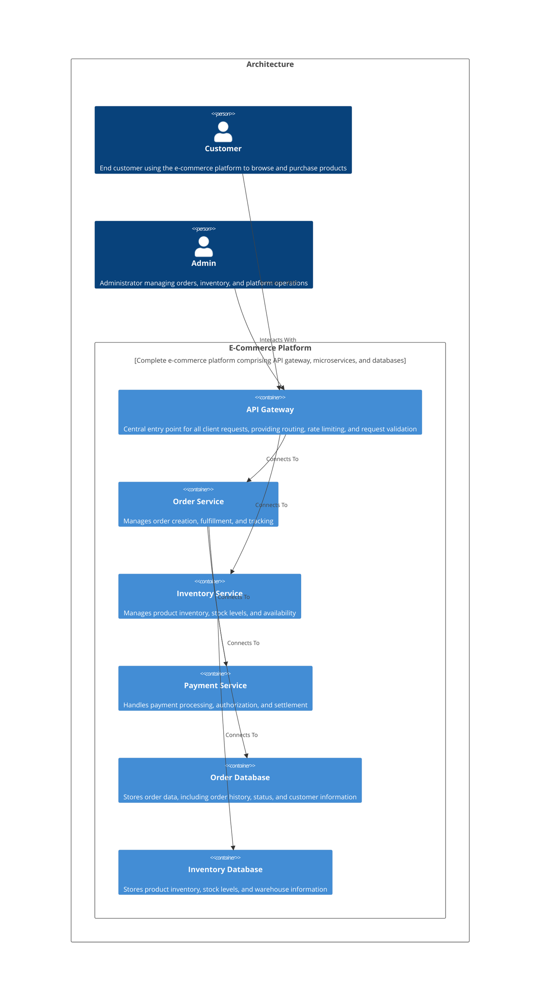

# Welcome to CALM Documentation

This documentation is generated from the **CALM Architecture-as-Code** model.

## High Level Architecture

## Nodes
    - [Customer](nodes/customer)
    - [Admin](nodes/admin)
    - [API Gateway](nodes/api-gateway)
    - [Order Service](nodes/order-service)
    - [Inventory Service](nodes/inventory-service)
    - [Payment Service](nodes/payment-service)
    - [Order Database](nodes/order-database)
    - [Inventory Database](nodes/inventory-database)
    - [E-Commerce Platform](nodes/ecommerce-platform)

## Relationships
    - [Customer Interacts Api Gateway](relationships/customer-interacts-api-gateway)
    - [Admin Interacts Api Gateway](relationships/admin-interacts-api-gateway)
    - [Api Gateway Connects Order Service](relationships/api-gateway-connects-order-service)
    - [Api Gateway Connects Inventory Service](relationships/api-gateway-connects-inventory-service)
    - [Order Service Connects Order Database](relationships/order-service-connects-order-database)
    - [Order Service Connects Payment Service](relationships/order-service-connects-payment-service)
    - [Inventory Service Connects Inventory Database](relationships/inventory-service-connects-inventory-database)
    - [Ecommerce Platform Composed Of Services](relationships/ecommerce-platform-composed-of-services)

## Flows
    - [Customer Order Processing](flows/order-processing-flow)
    - [Inventory Stock Check](flows/inventory-check-flow)

## Controls
| Requirement URL               | Category    | Scope        | Applied To                |
|-------------------------------|-----------|--------------|---------------------------|
|https://internal-policy.example.com/performance/rate-limiting|performance|Node|api-gateway|
|https://www.pcisecuritystandards.org/documents/PCI-DSS-v4.0|compliance|Node|payment-service|

## Metadata
  

      <table>
          <thead>
          <tr>
              <th>Key</th>
              <th>Value</th>
          </tr>
          </thead>
          <tbody>
          <tr>
              <td>
                  <b>Owner</b>
              </td>
              <td>
                  Gyula
                      </td>
          </tr>
          <tr>
              <td>
                  <b>Version</b>
              </td>
              <td>
                  1.0.0
                      </td>
          </tr>
          <tr>
              <td>
                  <b>Created</b>
              </td>
              <td>
                  2025-12-15
                      </td>
          </tr>
          <tr>
              <td>
                  <b>Description</b>
              </td>
              <td>
                  Microservices-based e-commerce platform for order processing, inventory management, and payments
                      </td>
          </tr>
          <tr>
              <td>
                  <b>Tags</b>
              </td>
              <td>
                  <ul>
                      <li>ecommerce</li>
                      <li>microservices</li>
                      <li>orders</li>
                  </ul>
              </td>
          </tr>
          </tbody>
      </table>
  

## Adrs
- [docs/adr/0001-use-message-queue-for-async-processing.md](docs/adr/0001-use-message-queue-for-async-processing.md)
- [docs/adr/0002-use-oauth2-for-api-authentication.md](docs/adr/0002-use-oauth2-for-api-authentication.md)
