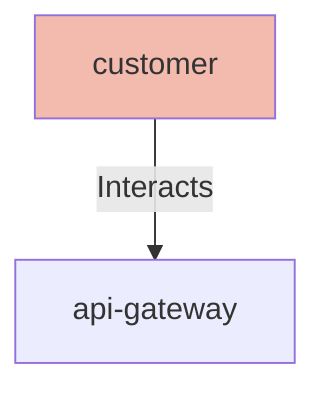

## Details

| Field               | Value                    |
|---------------------|--------------------------|
| **Unique ID**       | customer                   |
| **Node Type**       | actor             |
| **Name**            | Customer                 |
| **Description**     | End customer using the e-commerce platform to browse and purchase products          |

## Interfaces
    _No interfaces defined._

## Related Nodes

## Controls
    _No controls defined._

## Metadata
  _No Metadata defined._
