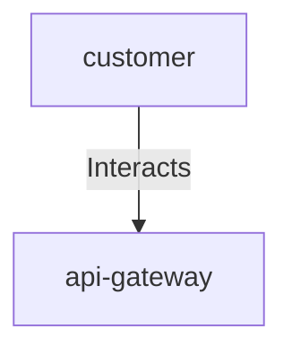

## Details

| Field               | Value                    |
|---------------------|--------------------------|
| **Unique ID**       | customer-interacts-api-gateway                   |
| **Description**      |  Customer interacts with the e-commerce platform through the API Gateway   |

## Related Nodes

## Controls
    _No controls defined._

## Metadata
  _No Metadata defined._
